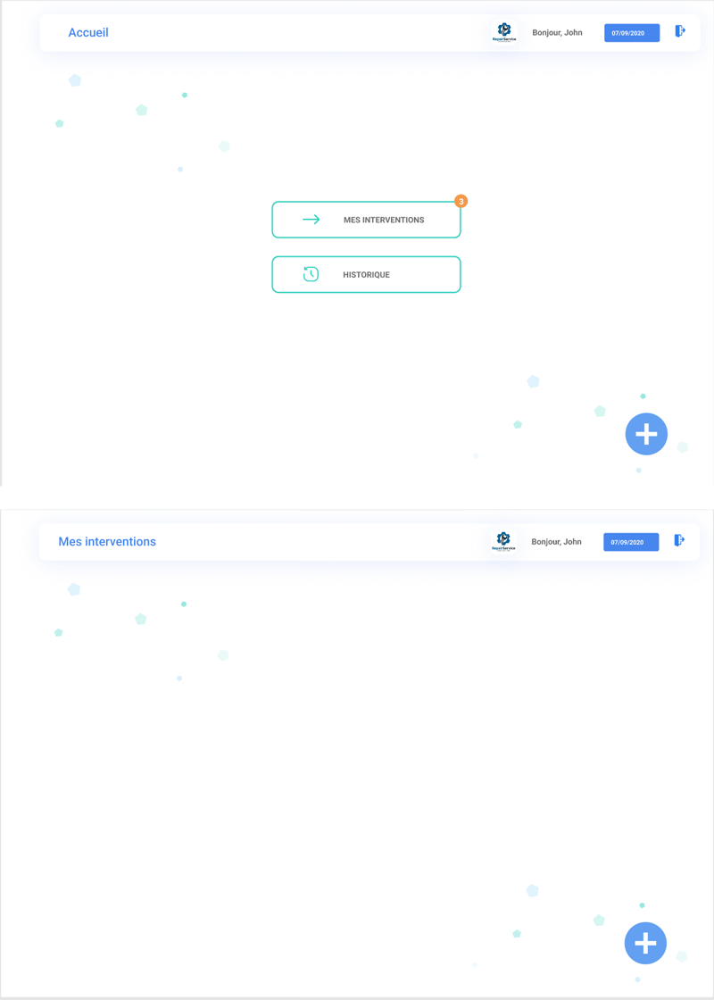

## webapp

L'objectif de cet exercice est de créer deux pages d’une webapp et de simuler une navigation entre elles.

Le screen A est une homePage présentant

- un header affichant
    - le nom de la page
    - un logo
    - un message "Bonjour John"
    - la date du jour dynamique
    - une icône (logout)
    - un body avec deux boutons "Mes interventions" et son icone. Cliquable permettant de naviguer vers la page "Mes interventions" "Historique" et son icône (Aucun lien)

- Le screen B est une page "Mes Interventions" présentant
    - un header identique au premier header au titre près. Le nom de la page est dynamique et envoyé depuis l'écran précédent
    - un body vide

Les deux pages sont :
- développées en utilisant react
- reprennent les éléments graphiques présentés sur une maquette figma (couleurs, police de caractères, icones, taille des éléments)
- une navigation grâce au module react-router-dom
- le header est un composant react autonome

